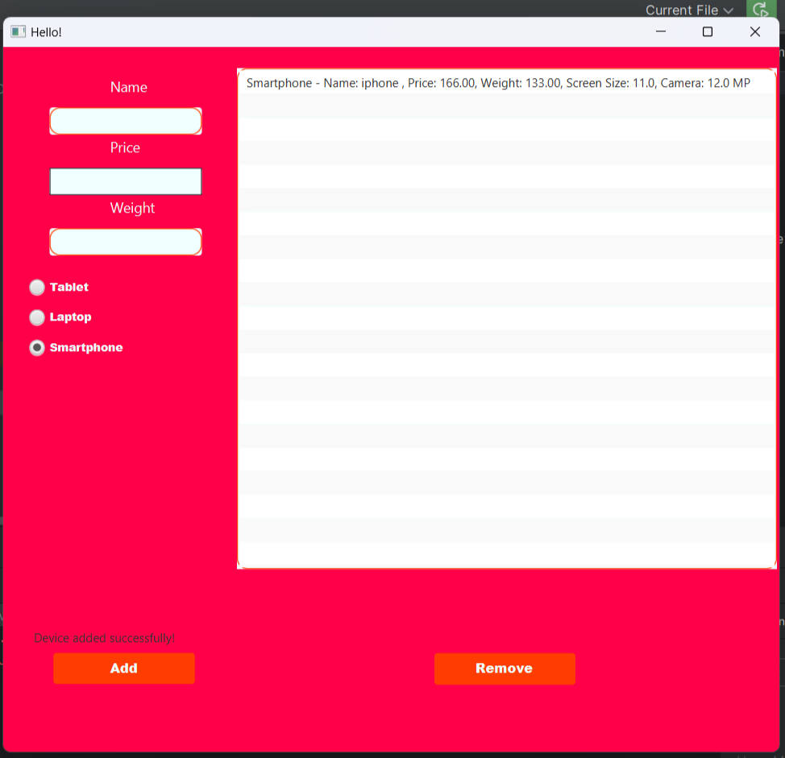
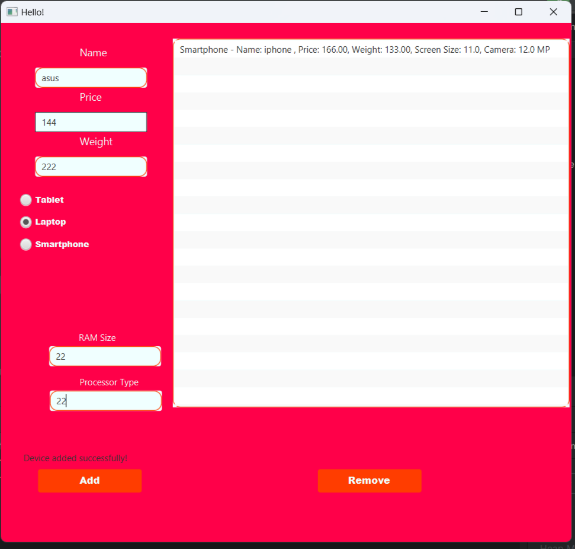
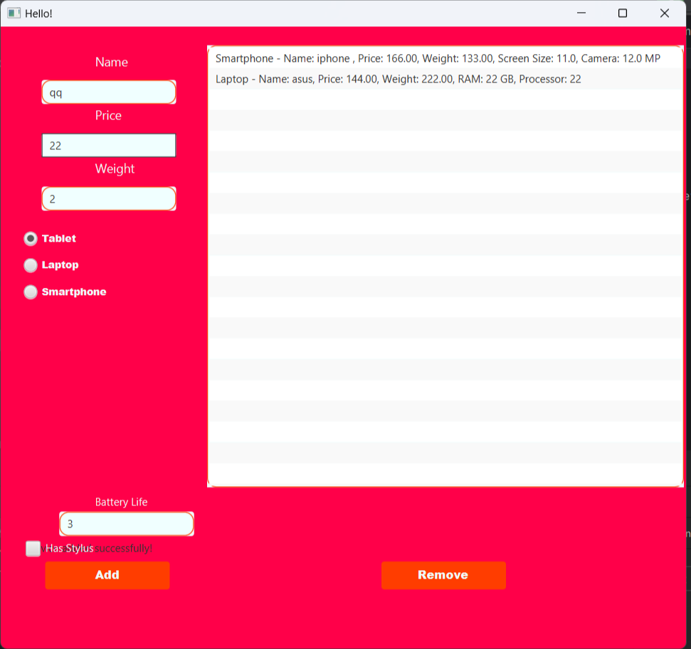

# Gadget Management System

This project is a JavaFX-based application that allows users to manage different types of gadgets (Smartphones, Laptops, Tablets) using object-oriented programming (OOP) principles. The app includes a base `Gadget` class with three derived classes for each device type. Users can add, view, and remove gadgets via an intuitive graphical user interface (GUI).

## Key Features

- **Gadget Types**: Models three types of gadgets - `Smartphone`, `Laptop`, and `Tablet`.
- **Attributes**: Each gadget type has unique attributes such as `screen size` for smartphones, `RAM` for laptops, and `battery life` for tablets.
- **JavaFX GUI**: A simple, user-friendly interface to input gadget details, add devices to the list, view the details, and remove gadgets.

### Class Breakdown

- **Gadget**: Base class with common attributes like `name`, `price`, and `weight`.
- **Smartphone**: Inherits from `Gadget` and adds specific attributes like `screen size` and `camera resolution`.
- **Laptop**: Extends the `Gadget` class and adds attributes like `RAM` and `processor type`.
- **Tablet**: Also extends `Gadget` and adds attributes such as `battery life` and `stylus support`.

## GUI Overview

1. **TabPane**: Contains tabs for each gadget type (`Smartphone`, `Laptop`, `Tablet`).
2. **TextFields**: Input fields for `name`, `price`, and `weight`, along with additional fields for each device type.
3. **Add Button**: Adds the gadget to the device list.
4. **ListView**: Displays all added gadgets.
5. **Remove Button**: Removes the selected device from the list.
6. **Status Labels**: Shows feedback messages to users, such as missing fields or successful addition/removal of a device.

## Getting Started

### Prerequisites

- **Java Development Kit (JDK) 8 or higher**.
- **JavaFX SDK** (required if using JDK versions lower than 11).
- **Git** (for cloning the repository).

### Running the Application

1. Clone the repository:
   ```bash
   git clone https://github.com/yourusername/GadgetManagementSystem
   cd gadget-management

   ## Screenshots


## Example Inputs

1. **Smartphone**:
   - Name: Galaxy S
   - Price: 799.99
   - Weight: 174.0
   - Screen Size: 6.1
   - Camera Resolution: 12.0
   
)

2. **Laptop**:
   - Name: Dell XPS 
   - Price: 1499.99
   - Weight: 1800.0
   - RAM Size: 16
   - Processor Type: Intel i7
   
)

3. **Tablet**:
   - Name: iPad Pro
   - Price: 1099.99
   - Weight: 468.0
   - Battery Life: 10.0
   - Has Stylus: Yes
  

## Evaluation Criteria

- **OOP Principles**: Correct implementation of inheritance and encapsulation in the `Device` class and its subclasses.
- **GUI Functionality**: A fully operational JavaFX interface for adding, viewing, and removing devices.
- **Code Quality**: Adherence to best practices, clear comments, and proper naming conventions.
- **Completeness**: Ensuring the GitHub link, README file, and UI samples are submitted.

## Author and License

This project is licensed under the MIT License.

